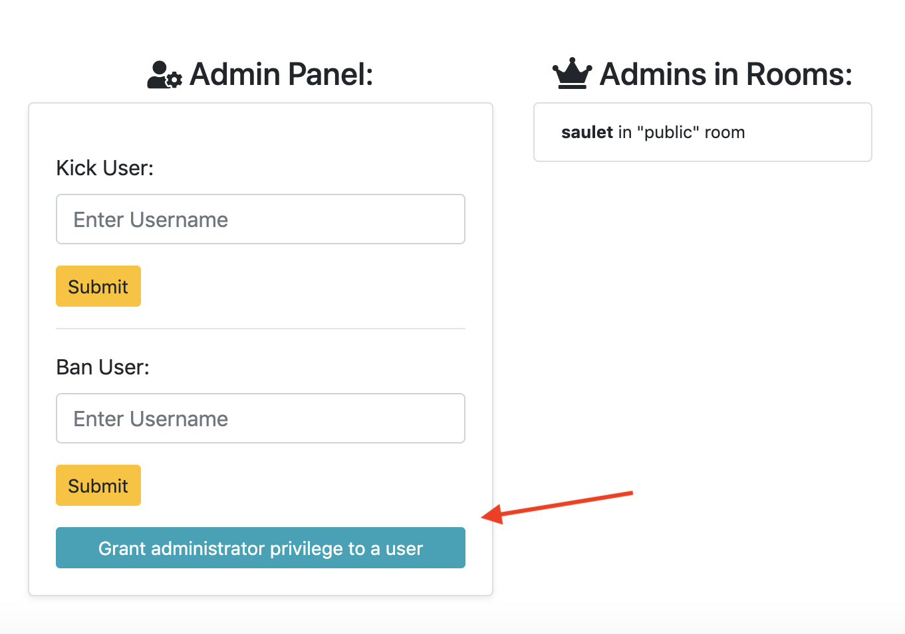
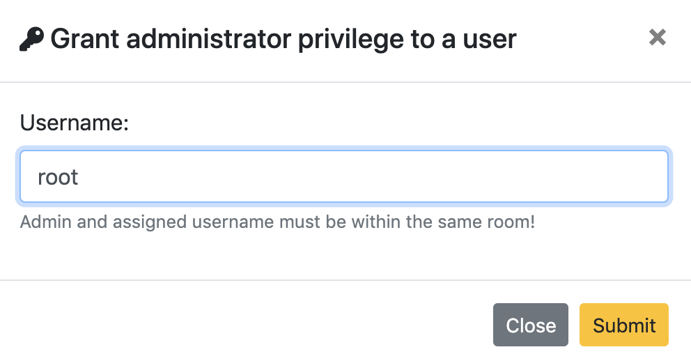
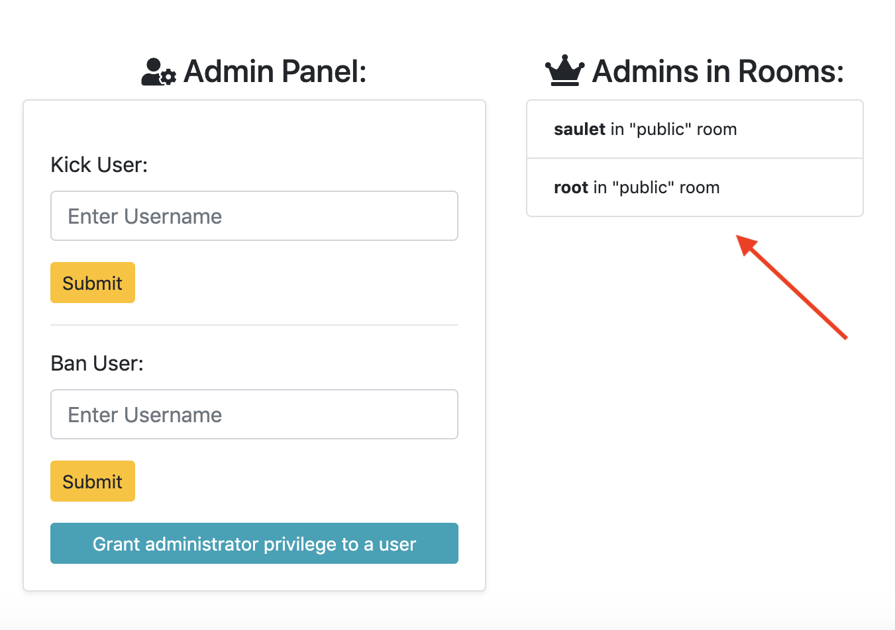

# CSE330
467511

## Module 6: Multi-Room Chat Server

## Usage:

Navigate to folder. Download project dependencies by simply running command:
```
npm install
```

After that, run web server using node by running command:

```
node server.js
```

Launch favorite browser (Google Chrome or Mozilla Firefox), and go to:

```
http://localhost:3000/
```

## Creative Portions:

**Give Administrator Privilege to Other Users** - 

<p style="text-align: center;">
    
</p>

<p style="text-align: center;">
    
</p>

<p style="text-align: center;">
    
</p>

### Author
* Saulet Yskak
